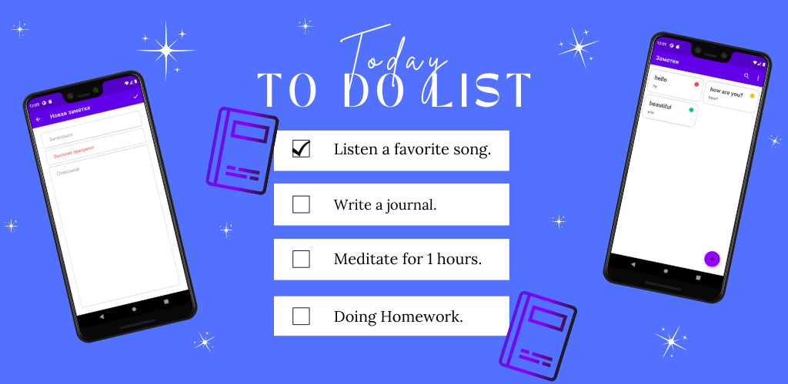

# :notebook_with_decorative_cover::open_book: **To Do App.**
## This project uses:
* Kotlin;
* MVVM;
* Navigation Components;
* View Model;
* Room;
* Material Design.
#

## Link on Google Play: https://tinyurl.com/znoukr
## This application was made in IDE Android Studio. For project build use Gradle and Android Studio:
* Click the button "Code" and download the ZIP-file;
* In Android Studio click "Import project";
* IDE will collect this project.
## If you will use command line:
* clone branch review with git clone or fork it and then clone it from your forked repo;
* cd znoukr;
* npm install;
* npm start.
